# Entra ID IT Support Lab

## Overview
This project simulates real-world IT Support tasks using Microsoft Entra ID (Azure AD), Jira Service Management, and PowerShell with Microsoft Graph.

The goal is to demonstrate hands-on experience in identity management, user lifecycle operations, and IT support ticket handling.

---

## Technologies Used
- Microsoft Entra ID (Azure AD)
- Jira (Kanban IT Support simulation)
- PowerShell
- Microsoft Graph Module

---

## Key Features

### 1. User and Identity Management (Entra ID)
- Created and managed multiple users
- Organized users into groups (HR, IT, Sales)
- Assigned roles (User / Admin)
- Reset user passwords
- Enabled / disabled user accounts

---

### 2. IT Support Simulation (Jira)
Simulated real IT support scenarios using a Kanban board:

- User forgot password → password reset
- Account locked → unlock via password reset
- User cannot login → troubleshooting (account status, sign-in logs)
- New user onboarding → account creation + group assignment

Ticket workflow:
- To Do → In Progress → Resolved
- Added comments and updates to simulate real support communication

---

### 3. Automation with PowerShell (Microsoft Graph)
- Connected to Entra ID using `Connect-MgGraph`
- Retrieved users using `Get-MgUser`
- Created users using `New-MgUser`
- Verified account creation and status

---

## Project Structure
 entra-id-it-support-lab/
│
├── docs/
├── scripts/
├── screenshots/
├── tickets/
└── README.md

---

## Screenshots

### Entra ID - Users
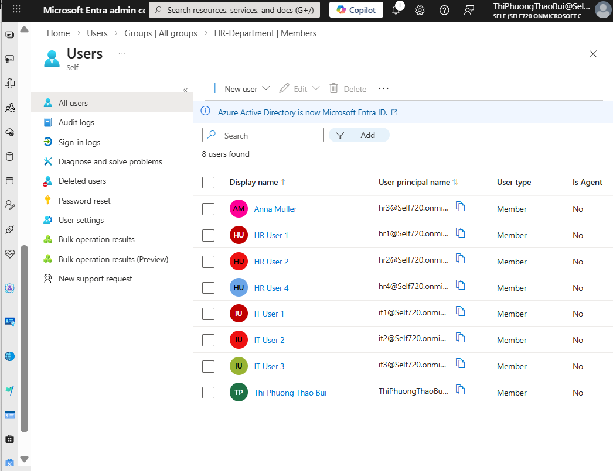

### Entra ID - Groups
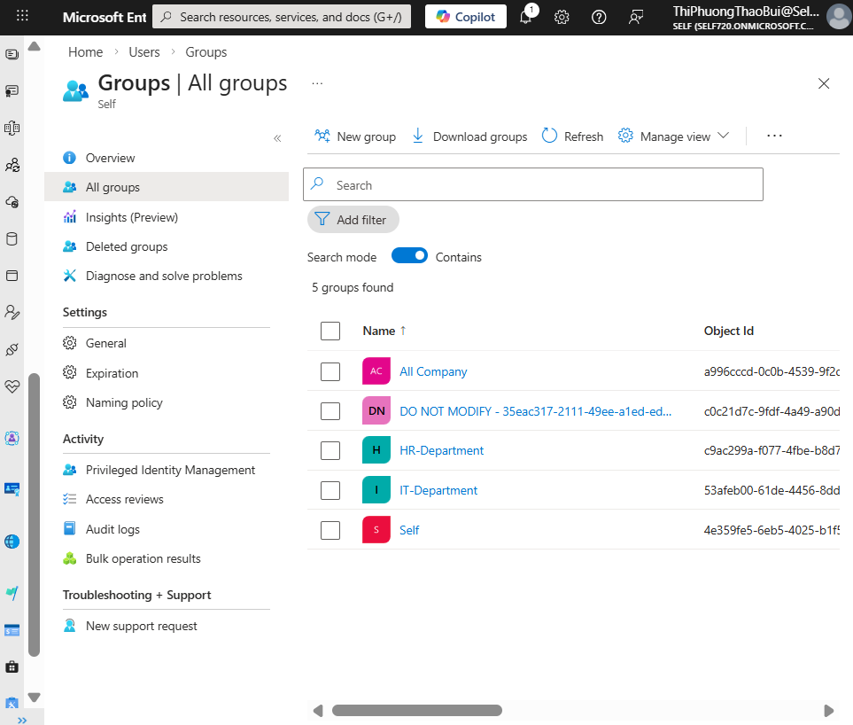

### Entra ID - Account Enable / Disable
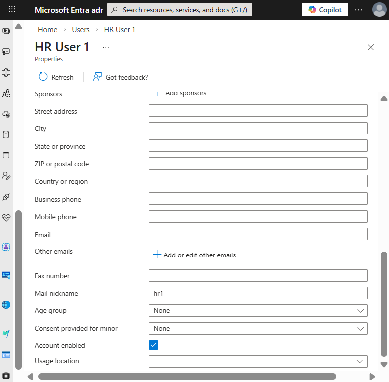

### Entra ID - Password Reset
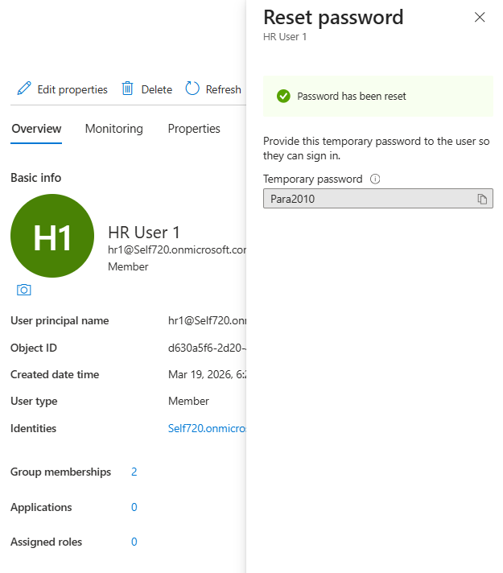

---

### Jira IT Support Board
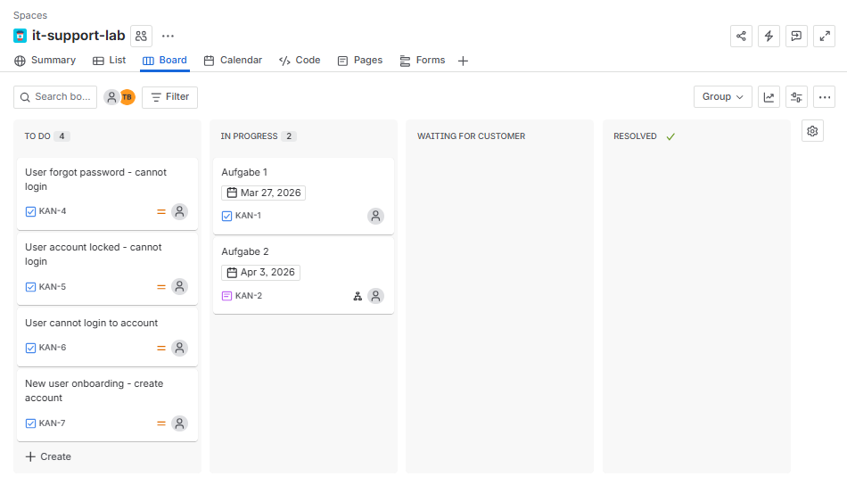

### Jira Ticket - Password Reset Case
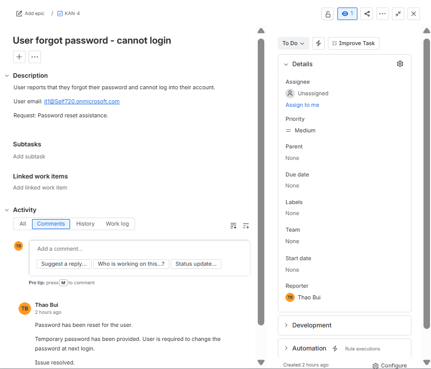

### Jira Ticket Flow (In Progress)
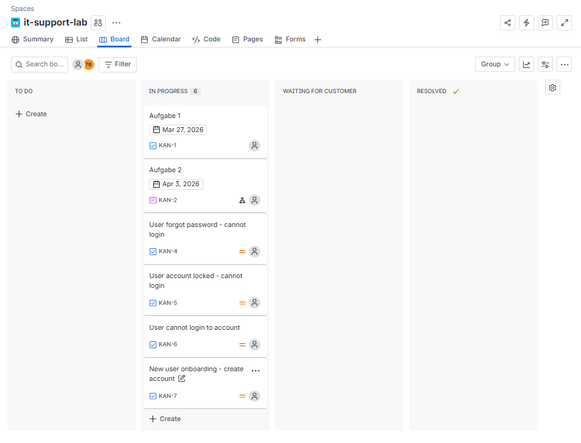

### Jira Ticket Flow (Resolved)
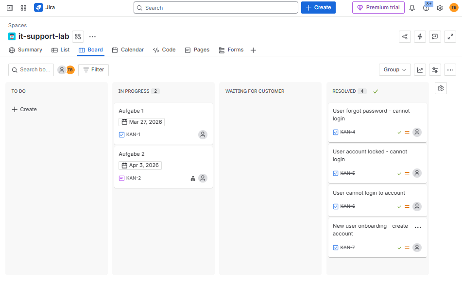

---

### PowerShell - Create User
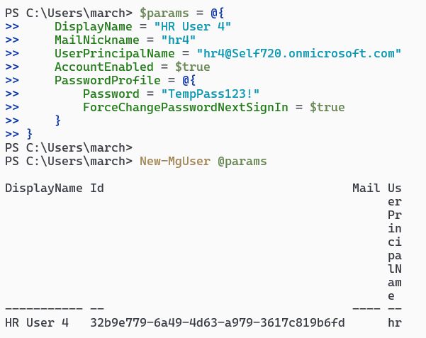

### PowerShell - List Users
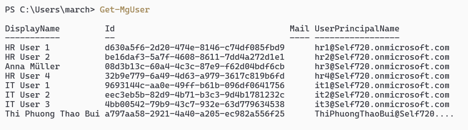

### PowerShell - Verify User
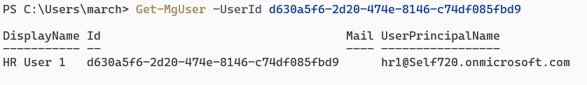

---

## Skills Demonstrated

- Identity and Access Management (IAM)
- User Lifecycle Management
- IT Support Troubleshooting
- Ticket Handling (Jira)
- PowerShell Automation
- Microsoft Graph API

---

## Author
Thao Bui
